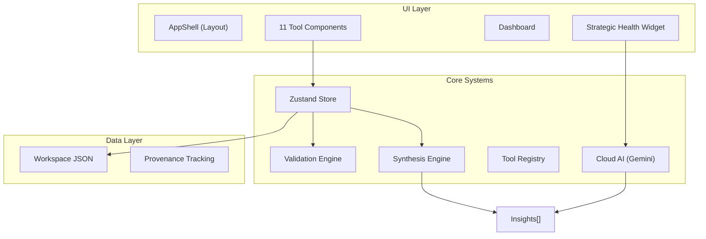
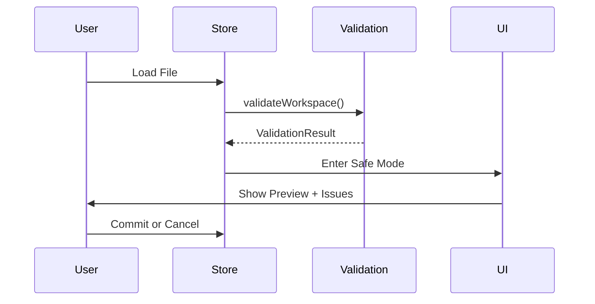

# VWCGApp - Master Technical Documentation

> **Version**: 1.1  |  **Generated**: 2026-01-22  |  **Status**: Audited & Complete

---

## Table of Contents

1. [Executive Summary](#1-executive-summary)
2. [Technology Stack](#2-technology-stack)
3. [Architecture Overview](#3-architecture-overview)
4. [Directory Structure](#4-directory-structure)
5. [Tool Registry](#5-tool-registry)
6. [State Management](#6-state-management)
7. [Synthesis Engine](#7-synthesis-engine)
8. [Validation System](#8-validation-system)
9. [Tool Deep Dives](#9-tool-deep-dives)
10. [AI Consultation Feature](#10-ai-consultation-feature)
11. [Workspace File Format](#11-workspace-file-format)
12. [Safe Mode](#12-safe-mode)
13. [Key Patterns](#13-key-patterns)
14. [Known Issues & Technical Debt](#14-known-issues--technical-debt)
15. [Performance Considerations](#15-performance-considerations)
16. [Future Enhancement Areas](#16-future-enhancement-areas)

---

## 1. Executive Summary

**VWCGApp** (Value-Weighted Capability Gap Application) is a React-based strategic assessment platform designed to help executives and advisors evaluate organizational readiness, identify strategic risks, and create actionable roadmaps.

### Key Capabilities
- **11 Integrated Tools** for strategic planning and assessment
- **Cross-Tool Synthesis Engine** that generates insights from combined data
- **Robust Validation System** with L0-L3 validation levels
- **Workspace Persistence** with Save/Load and Safe Mode protection
- **Report Generation** with PDF export
- **AI Consultation** via Gemini API integration

---

## 2. Technology Stack

| Layer | Technology |
|:------|:-----------|
| **Framework** | React 19.2 + TypeScript 5.9 |
| **Build Tool** | Vite 7.2 |
| **Styling** | TailwindCSS 3.4 |
| **State Management** | Zustand 5.0 |
| **Routing** | React Router DOM 7.11 |
| **Charts** | Chart.js 4.5 + react-chartjs-2 5.3 |
| **Visualization** | D3.js 7.9 |
| **PDF Generation** | jsPDF 3.0 + html2canvas 1.4 |
| **Icons** | Lucide React 0.562 |

---

## 3. Architecture Overview



### Data Flow
1. **User Input** → Tool Component → `updateToolData(toolId, data)`
2. **State Update** → Zustand Store triggers Synthesis Engine
3. **Synthesis** → Rules execute → Insights generated
4. **Display** → Dashboard shows Strategic Health + Insights
5. **AI Consultation** (Optional) → "Consult AI" → Gemini API → Cloud Insights

---

## 4. Directory Structure

```
src/
├── components/          # Shared UI components
│   ├── layout/         # AppShell, SafeModeBanner
│   ├── ui/             # Button, ExportButton, etc.
│   └── dashboard/      # StrategicHealthWidget
├── engine/             # Business Logic
│   ├── synthesis.ts    # Insight generation
│   ├── rules.ts        # 5 Synthesis Rules
│   ├── cloud.ts        # Gemini AI integration
│   ├── prompts.ts      # LLM prompt templates
│   └── types.ts        # Insight, SynthesisRule types
├── registry/           # Tool registration
│   ├── ToolRegistry.ts # Interface + functions
│   └── registry.ts     # initializeRegistry()
├── store/              # State Management
│   └── workspaceStore.ts # Zustand global store
├── tools/              # 11 Tool Implementations
│   ├── ai-readiness/
│   ├── leadership-dna/
│   ├── emotional-intelligence/
│   ├── vision-canvas/
│   ├── swot/
│   ├── sop/
│   ├── roadmap/
│   ├── advisor-readiness/
│   ├── report/
│   └── dashboard/
├── validation/         # Data Validation
│   ├── validator.ts    # Main validation logic
│   ├── types.ts        # ValidationIssue, Profile
│   └── profiles_p*.ts  # Per-tool profiles
└── lib/                # Utilities
    └── charts.ts       # Chart.js registration
```

---

## 5. Tool Registry

All tools are registered in `src/registry/registry.ts`:

| # | Tool ID | Name | Validation Profile |
|:--|:--------|:-----|:-------------------|
| 1 | `ai-readiness` | AI Readiness Assessment | `aireadiness_v1` |
| 2 | `leadership-dna` | Leadership DNA | `leadership_radar_v1` |
| 3 | `bei` | Business Emotional Intelligence | `bei_v1` |
| 4 | `vision-canvas` | Vision Canvas | `vision_canvas_v1` |
| 5 | `swot` | SWOT Analysis | `swot_v1` |
| 6 | `sop-taxonomy` | SOP Taxonomy | `sop_taxonomy_v1` |
| 7 | `sop-create` | SOP Creation | `sop_create_v1` |
| 8 | `sop-manage` | SOP Management | `sop_manage_v1` |
| 9 | `roadmap` | 90-Day Roadmap | `roadmap_90_v1` |
| 10 | `advisor-readiness` | Advisor Readiness | `advisor_readiness_v1` |
| 11 | `report` | Report Center | *(none)* |

---

## 6. State Management

### Zustand Store (`workspaceStore.ts`)

```typescript
interface WorkspaceState {
    version: string;
    metadata: WorkspaceMetadata;
    tools: Record<string, any>;      // Tool data by ID
    provenance: Record<string, any>; // Edit history
    insights: Insight[];             // Generated insights
    isSafeMode: boolean;             // Load protection
    previewData: any;                // Staged import data
    validationResults: any;          // Import validation
}
```

### Key Actions
| Action | Purpose |
|:-------|:--------|
| `updateToolData(id, data)` | Update tool + trigger synthesis |
| `stageWorkspace(data)` | Enter Safe Mode with preview |
| `commitWorkspace()` | Accept staged data |
| `cancelLoad()` | Reject staged data |
| `recomputeLogic()` | Upgrade logic version |
| `exportState()` | Serialize for save (5s cooldown) |

---

## 7. Synthesis Engine

### Overview
The Synthesis Engine runs **5 cross-tool rules** on every state update to generate actionable insights.

### Rules

| ID | Name | Trigger Conditions | Severity |
|:---|:-----|:-------------------|:---------|
| `E1` | Execution Gap | Leadership DNA `Execution` < 6 + Vision Canvas pillars > threshold | High |
| `E2` | Unmitigated Threat | SWOT Threat (confidence ≥ 4) keyword not in Roadmap tasks | Medium |
| `E3` | Burnout Risk | Advisor maturity < 50% + Roadmap tasks > safe capacity | High |
| `E4` | Strength Leverage | Leadership DNA `Innovation` ≥ 8 + Roadmap contains "launch/new/pivot" | Low |
| `E5` | SOP Metric Missing | SOP in library without Metrics block | Medium |

> **⚠️ Known Issue (E4)**: The Leadership DNA tool does NOT have an "Innovation" dimension. Current dimensions are: Vision, Execution, Empowerment, Decisiveness, Adaptability, Integrity. The E4 rule will **never trigger** until either the dimension is added or the rule is updated.

### Insight Structure
```typescript
interface Insight {
    id: string;
    type: 'risk' | 'opportunity' | 'conflict' | 'strength';
    severity: 'high' | 'medium' | 'low';
    title: string;
    message: string;
    recommendation: string;
    relatedTools: string[];
}
```

---

## 8. Validation System

### 3-Level Architecture

| Level | Scope | Examples |
|:------|:------|:---------|
| **L0** | Structural | JSON valid, `metadata` exists |
| **L1** | Field Presence | Required fields present |
| **L2** | Value Ranges | Scores 0-10, Quadrants S/W/O/T |
| **L3** | Semantic | Self-dependency detection |

### Error Code Format
```
[TOOL]-[TYPE]-[NUM]
```
Examples:
- `AIR-REQ-001` = AI Readiness, Required field, #1
- `LDR-VAL-002` = Leadership DNA, Value validation, #2
- `RDM-CYC-001` = Roadmap, Cycle detection, #1

---

## 9. Tool Deep Dives

### 9.1 AI Readiness Assessment
**Purpose**: Evaluate organizational preparedness for AI adoption across 6 dimensions.

**Dimensions**: Strategy, Data, Infrastructure, Talent, Governance, Culture

**Data Schema** (Actual Implementation):
```typescript
interface AiReadinessData {
    Strategy: number;      // 0-100
    Data: number;          // 0-100
    Infrastructure: number;// 0-100
    Talent: number;        // 0-100
    Governance: number;    // 0-100
    Culture: number;       // 0-100
}
```

**Visualization**: Radar chart (react-chartjs-2)

> **⚠️ Schema Mismatch**: Validation profile expects `dimensions[]` array with `weight` fields summing to 1.0. Implementation uses flat fields. Validation may not work correctly.

---

### 9.2 Leadership DNA
**Purpose**: Radar chart of 6 leadership dimensions (Current vs Target).

**Dimensions**: Vision, Execution, Empowerment, Decisiveness, Adaptability, Integrity

**Data Schema**:
```typescript
{
    current_Vision: number;       // 0-10
    target_Vision: number;        // 0-10
    current_Execution: number;    // 0-10
    target_Execution: number;     // 0-10
    current_Empowerment: number;  // 0-10
    target_Empowerment: number;   // 0-10
    current_Decisiveness: number; // 0-10
    target_Decisiveness: number;  // 0-10
    current_Adaptability: number; // 0-10
    target_Adaptability: number;  // 0-10
    current_Integrity: number;    // 0-10
    target_Integrity: number;     // 0-10
}
```

**Synthesis Integration**: Execution score used in E1 rule.

---

### 9.3 Business Emotional Intelligence (BEI)
**Purpose**: Track emotional intelligence metrics over time with trend visualization.

**Data Schema**:
```typescript
interface BeiData {
    entries: {
        id: string;
        date: string;  // ISO8601
        dimensions: {
            id: string;           // e.g., 'self_awareness', 'empathy'
            score: number;        // 1-10
            confidence: number;   // 1-5
        }[];
    }[];
}
```

**Dimensions**: Self Awareness, Self Regulation, Motivation, Empathy, Social Skills, Intuition

**Visualization**: Multi-line trend chart (Chart.js)

---

### 9.4 Vision Canvas
**Purpose**: Define North Star metric, strategic pillars (max 6), and core values.

**Data Schema**:
```typescript
interface VisionData {
    northStar: string;
    pillars: { id: string; title: string; kpi: string; }[];
    values: { id: string; text: string; }[];
}
```

**Synthesis Integration**: Pillar count used in E1 (Execution Gap) rule.

---

### 9.5 SWOT Analysis
**Purpose**: Identify internal strengths/weaknesses and external opportunities/threats.

**Data Schema** (Actual Implementation):
```typescript
interface SwotData {
    strengths: SwotItem[];
    weaknesses: SwotItem[];
    opportunities: SwotItem[];
    threats: SwotItem[];
}

interface SwotItem {
    id: string;
    text: string;
    confidence: number;  // 1-5
}
```

**Visualization**: 4-quadrant matrix (SwotMatrix component)

**Synthesis Integration**: `threats` with confidence ≥ 4 used in E2 rule.

> **⚠️ Schema Mismatch**: Validation profile expects a flat `items[]` array with `quadrant: 'S'|'W'|'O'|'T'`. Implementation uses separate arrays per quadrant.

---

### 9.6 SOP Suite (Taxonomy, Creation, Management)
**Purpose**: Create, organize, and manage Standard Operating Procedures.

**SOP Taxonomy Data**:
```typescript
interface TaxonomyData {
    nodes: {
        id: string;
        name: string;
        parentId?: string;
    }[];
}
```

**SOP Creation Data**:
```typescript
interface SopData {
    sop: {
        id: string;
        title: string;
        steps: { id: string; content: string; }[];
        blocks?: { type: string; content: string; }[];
    };
}
```

**SOP Management Data**:
```typescript
interface SopManagementData {
    library: SopData['sop'][];
}
```

**Synthesis Integration**: SOPs without `metrics` block trigger E5 rule.

---

### 9.7 90-Day Roadmap
**Purpose**: Task planning with week assignments (1-12) and dependency tracking.

**Data Schema** (Actual Implementation):
```typescript
interface RoadmapData {
    tasks: RoadmapTask[];
}

interface RoadmapTask {
    id: string;
    title: string;
    owner: string;
    week: number;                    // 1-12
    status: 'planned' | 'in-progress' | 'completed';
    dependencies: string;            // Freeform text, NOT array
}
```

**Visualization**: Timeline view (RoadmapTimeline component)

**Validation**: Self-dependency detection (L3).

**Synthesis Integration**: Task count used in E2, E3 rules.

---

### 9.8 Advisor Readiness
**Purpose**: 4-tab diagnostic for strategic consulting readiness.

**Tabs**:
1. **Diagnostic**: 20+ questions across categories, 1-5 rating scale
2. **Analysis**: Category-based visualization (AdvisorResults)
3. **ROI & Value**: Valuation scenario projections (Best/Likely/Worst)
4. **Impact & Risks**: Risk register + Initiative prioritization

**Data Schema**:
```typescript
interface AdvisorData {
    answers: Record<string, number>;  // questionId → score (1-5)
}
```

**Synthesis Integration**: Maturity % (sum/max) used in E3 (Burnout Risk) rule.

---

### 9.9 Report Center
**Purpose**: Generate PDF exports of workspace data.

**Components**:
- `ReportCenter.tsx` - Main UI with section toggles
- `ReportPreview.tsx` - Print preview rendering
- `PdfService.ts` - jsPDF + html2canvas generation
- `ExportButton.tsx` - Individual tool export button

**Export Options**:
1. **Full Report Export**: Via Report Center, select sections to include
2. **Individual Tool Export**: Each tool has an "Export PDF" button in its header

**Export Flow (Full Report)**:
1. User selects sections to include
2. Preview rendered with tool data
3. "Download PDF" triggers `PdfService.generatePdf()`
4. HTML captured via html2canvas, paginated to PDF

**Export Flow (Individual Tool)**:
1. User clicks "Export PDF" button in tool header
2. Tool renders its exportable content to hidden container
3. `PdfService.generatePdf()` captures and generates PDF
4. Button shows "Exporting..." during generation

---

## 10. AI Consultation Feature

**Location**: `src/engine/cloud.ts`, `src/components/dashboard/StrategicHealthWidget.tsx`

### Overview
Users can click "Consult AI" in the Strategic Health Widget to get additional insights from Google Gemini.

### Flow
1. User clicks "Consult AI" button
2. If no API key, modal prompts for Gemini API key (stored in localStorage)
3. `consultAi(workspaceState, apiKey)` sends workspace context to Gemini
4. Response parsed into `Insight[]` format
5. Cloud insights prefixed with `cloud_` and displayed with "AI Generated" badge

### API Key Storage
- Key stored in `localStorage` under `VWCG_GEMINI_KEY`
- Key never sent to any server except Google's Gemini API directly

---

## 11. Workspace File Format

```json
{
    "version": "1.0",
    "metadata": {
        "id": "uuid",
        "name": "My Workspace",
        "createdAt": "ISO8601",
        "lastModified": "ISO8601",
        "schema_version": "v1",
        "computed_under_logic_version": "v1.1.0"
    },
    "tools": {
        "vision-canvas": { ... },
        "leadership-dna": { ... }
    },
    "provenance": {
        "vision-canvas": {
            "timestamp": "ISO8601",
            "logicVersion": "v1.1.0"
        }
    }
}
```

**Extension**: `.vwcg` or `.json`

---

## 12. Safe Mode

**Purpose**: Protect user data during file imports.

### Flow


### UI Indicators
- Yellow banner when in Safe Mode
- Validation issues displayed
- Tool selection for partial import

---

## 13. Key Patterns

### Tool Implementation Pattern
```typescript
const TOOL_ID = 'my-tool';

interface MyToolData { ... }

const EMPTY_DATA: MyToolData = { ... };

export const MyTool: React.FC = () => {
    const { tools, updateToolData } = useWorkspaceStore();
    const data = (tools[TOOL_ID] as MyToolData) || EMPTY_DATA;

    const updateData = (newData: Partial<MyToolData>) => {
        updateToolData(TOOL_ID, { ...data, ...newData });
    };

    return ( ... );
};
```

### Validation Profile Pattern
```typescript
export const myProfile: ToolValidationProfile = {
    id: 'mytool_v1',
    validate: (data: any) => {
        const issues: ValidationIssue[] = [];
        // L1: Check required fields
        // L2: Check value ranges
        return issues;
    }
};
```

---

## 14. Known Issues & Technical Debt

| Issue | Location | Severity |
|:------|:---------|:---------|
| E4 rule references non-existent `Innovation` dimension | `engine/rules.ts` | High |
| SWOT validation expects flat `items[]`, impl uses separate arrays | `validation/profiles_p2.ts` vs `tools/swot/` | Medium |
| AI Readiness validation expects `dimensions[]`, impl uses flat fields | `validation/profiles_p1.ts` vs `tools/ai-readiness/` | Medium |
| Roadmap `dependencies` is string not array | Schema doc vs impl | Low |

---

## 15. Performance Considerations

| Concern | Mitigation |
|:--------|:-----------|
| Synthesis on every update | Rules are lightweight, O(n) |
| Chart re-renders | Chart.js memoization |
| Large workspace files | Canonical serialization |
| Export spam | 5-second cooldown |

---

## 16. Future Enhancement Areas

1. **Cloud Sync** - `engine/cloud.ts` has placeholder for team workspaces
2. **AI Prompts** - `engine/prompts.ts` defines LLM integration templates
3. **Additional Rules** - Extensible via `registerRule()`
4. **Additional Validation** - Extensible via `registerProfile()`
5. **Fix Schema Mismatches** - Align validation profiles with actual implementations

---

*End of Documentation*
